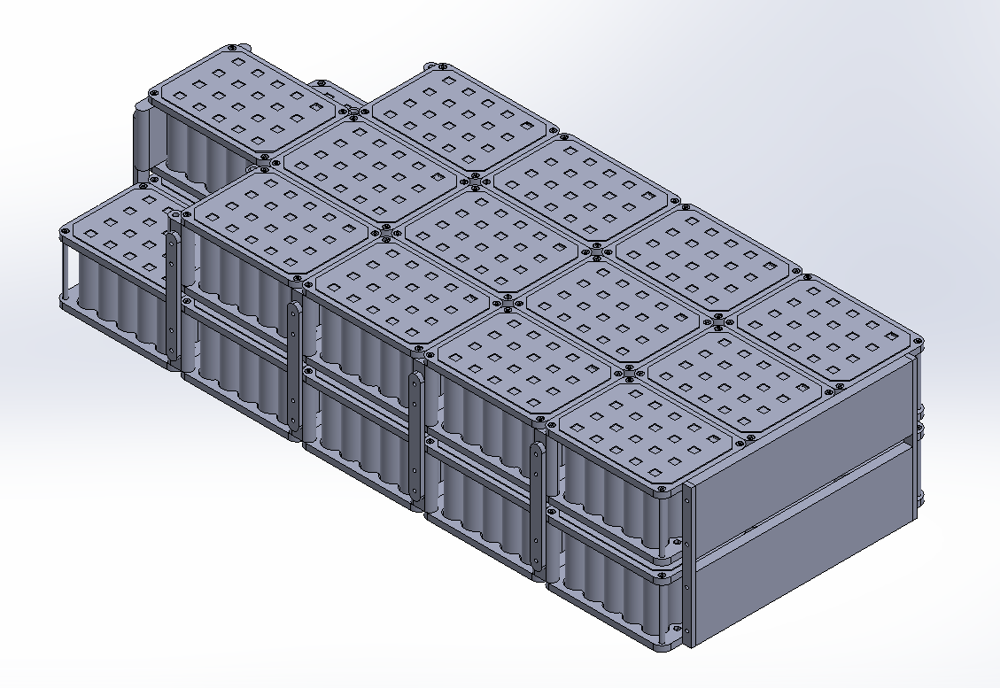
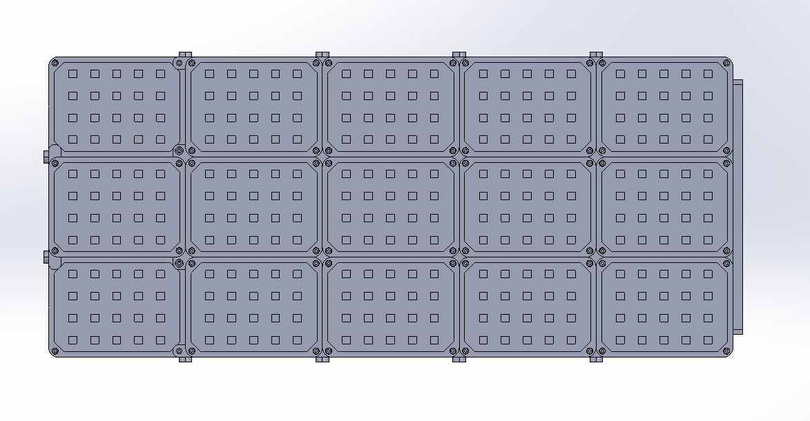

# Ghost Electric Motorcycle - High-Voltage Battery Subsystem

A modular, high-voltage (~120V) lithium-ion battery pack architecture and 3D structural packaging assembly designed for the Ghost Electric Motorcycle powertrain. The design prioritizes volumetric packaging density, mechanical cell constraint against vehicle vibration, serviceability, and high-voltage isolation.

---

## CAD Assembly Renders

*Isometric view detailing the multi-tier modular module stack, cylindrical cell retaining plates, vertical structural standoffs, and mounting bracket interconnects.*

*Top-down packaging view showing the 3x6 modular array configuration, cell alignment geometry, and inter-module spacing.*

---

## Mechanical Architecture & Electrical Integration

- **Modular Module Packaging:** Multi-module packaging architecture designed to maximize cell capacity within the restrictive spatial envelope of an electric motorcycle frame.
- **Cell Retention & Vibration Damping:** Custom top and bottom retaining plates engineered to secure cylindrical cells, eliminate relative motion during dynamic road loads, and maintain uniform air gap tolerances.
- **Structural Stacking & Fastening:** Integrated vertical standoffs, lateral tie-plates, and perimeter fastener points providing torsional rigidity across stacked tiers while facilitating modular replacement.
- **High-Voltage Routing & Safety Footprint:** Physical footprint designed for low-inductance busbar interconnects, high-voltage fuse isolation, inter-module series linking, and harness routing for the Battery Management System (BMS).

---

## Development Roadmap

- **Gen 1 (Concept & Packaging Validation):** Full-scale 3D CAD mechanical assembly, spatial frame fitting, structural standoff validation, and vibration-resistant cell retention design.
- **Gen 2 (Production Subsystems):** Final cell interconnect busbar sizing, thermal dissipation modeling, Orion BMS tap harness routing, and CAN bus telemetry integration.

---

## Directory Structure

    ├── gen1-concept/
    │   ├── cad/
    │   │   └── 24-BA-02 FULL BATTERY ASSY 3.23.2026.STEP   <-- 3D CAD assembly neutral STEP model
    │   └── renders/
    │       ├── Full-Pack-IsometricView.png                 <-- Isometric assembly render
    │       └── Full-Pack-TopView.png                       <-- Top-down packaging render
    ├── gen2-production/                                    <-- Active module design, schematics & sizing
    ├── .gitignore                                          <-- CAD temporary file & lock exclusions
    └── README.md                                           <-- Technical specifications

---

## Tools & Technical Specifications

- **CAD Suite:** SolidWorks
- **Target Powertrain:** 120V High-Voltage Electric Motorcycle
- **Key Focus Areas:** EV Battery Packaging, Cell Retention & Structural Integration, High-Voltage Safety, Modular Power Systems
